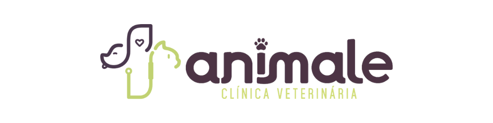

# Animale — Clínica Veterinária

Landing page institucional para a Animale Clínica Veterinária, criada para transformar visitas em conversas no WhatsApp e tornar o atendimento 24 horas, as especialidades e as unidades mais fáceis de encontrar.



## O que o site faz pela clínica

- Dá destaque imediato ao atendimento veterinário 24h e aos canais de contato.
- Direciona cada chamada para ação ao WhatsApp com dados do tutor, pet, assunto e unidade já organizados.
- Apresenta serviços, equipe, unidades, rotas no mapa e contatos em uma navegação curta e objetiva.
- Oferece uma experiência responsiva, com acessibilidade básica, carregamento adiado de imagens secundárias e suporte a redução de movimento.
- Inclui dados estruturados para ajudar buscadores a entenderem a clínica como negócio local em Colatina — ES.

## Informações que precisam ser confirmadas antes da publicação

O layout está pronto, mas estes dados devem ser fornecidos ou validados pela clínica para que o site represente a operação com precisão e gere mais confiança:

| Informação | Por que é importante |
| --- | --- |
| Domínio oficial | Permite adicionar URL canônica, imagem de compartilhamento e e-mail profissional. |
| Fotos reais da equipe, estrutura e atendimento | Substituem fotos de banco de imagem e criam reconhecimento local. |
| Avaliações reais e link do Perfil da Empresa no Google | Transformam os números e depoimentos em prova social verificável. |
| Lista completa de especialidades, exames e convênios | Evita dúvidas antes do contato e qualifica os pedidos recebidos. |
| Horários de cada unidade e regra de urgência | Distingue claramente o hospital 24h da clínica. |
| Política de privacidade e dados do responsável | Dá transparência ao formulário e apoia conformidade com a LGPD. |
| Ferramenta de métricas | Mede cliques em WhatsApp, telefone, rotas e formulário para melhorar a conversão. |

## Tecnologias

- HTML5 semântico
- CSS3 responsivo
- JavaScript puro
- PWA (`manifest.json`)

## Executar localmente

Por ser um site estático, basta abrir `index.html` no navegador. Para testar em um servidor local, use qualquer extensão de servidor estático do editor, como Live Server.

## Configuração de contatos

Os dados principais ficam no início de [script.js](script.js):

```js
const clinic = {
  whatsapp: '5527997880080',
  phoneDisplay: '(27) 99788-0080'
};
```

Também revise os endereços, telefones das duas unidades, e-mail e dados estruturados em [index.html](index.html) antes de publicar.

## Checklist de publicação

- [ ] Confirmar telefones, e-mail, endereços e atendimento 24h.
- [ ] Inserir domínio, URL canônica e imagem de compartilhamento.
- [ ] Trocar fotos de banco por fotos autorizadas da Animale.
- [ ] Validar avaliações, depoimentos e métricas exibidas.
- [ ] Adicionar política de privacidade e configurar métricas.
- [ ] Testar formulário, mapas e links no celular.

---

Desenvolvido para aproximar tutores de um cuidado veterinário rápido, claro e acolhedor.
